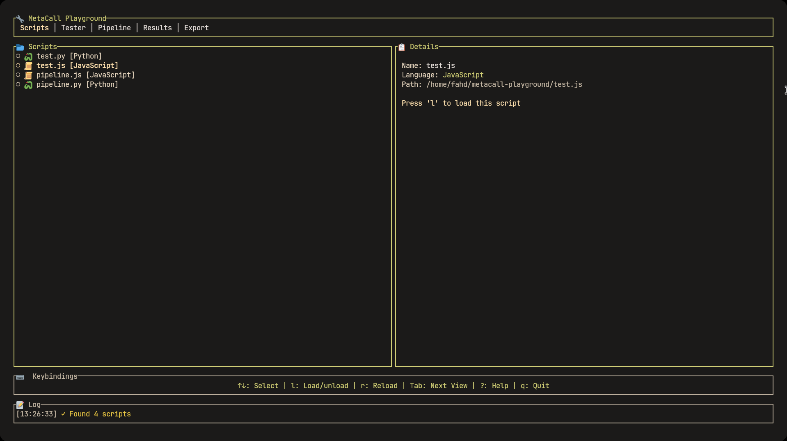

# MetaCall Playground

## description
A playground where you can run tests for polygot languages, create piplines and execute them, see real-time logs and statistics.
An Interactive TUI for testing polyglot function calls and pipeline development, brought by the efforts of `ratatui` and `MetaCall` amazing projects.

## what is MetaCall?
MetaCall is a library that allows polyglot languages to coexist and share data between them. MetaCall powers this application and other cool apps.

